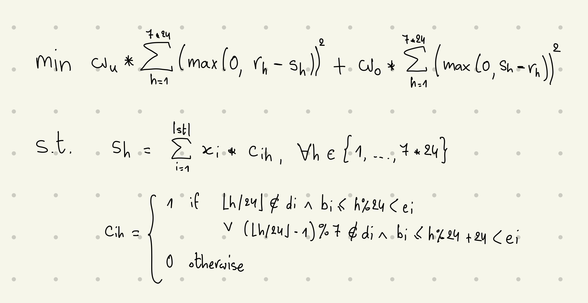
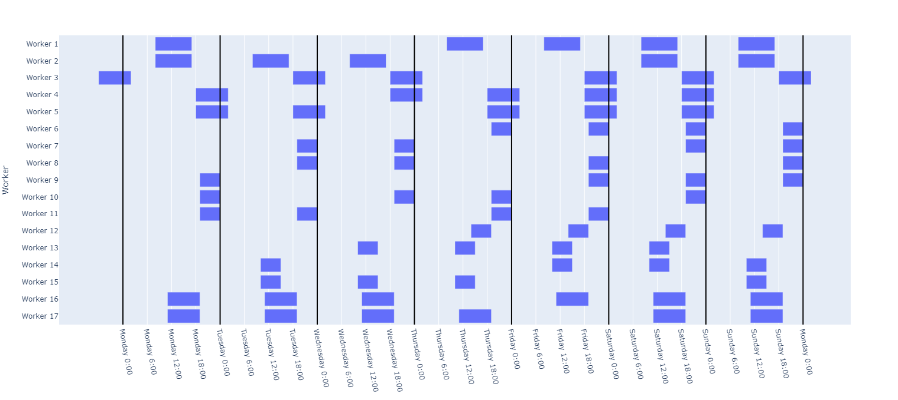
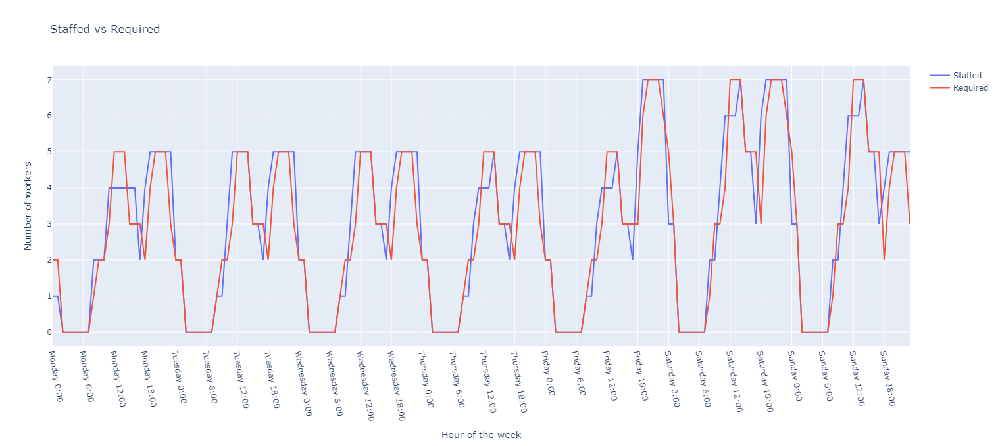

# Scheduling workers

Given hourly worker requirements for a whole week and possible shift types (start hour, end hour, number of days off per week), we want to find the number of workers we need to assign to each shift type and chosen days off to be as close as possible to requirements.__
Solving this problem manually would take hours, but can be done in seconds thanks to constraint programming!__
By using Python and or-tools library, we implemented the mathematical model below:

$`r_h`$ is the number of required workers for hour $`h \in \{1, .., 7*24\}`$  
$`s_h`$ is the number of staffed workers for hour $`h \in \{1, .., 7*24\}`$  
$`w_u`$ is the weight we assign to understaffing penalty  
$`w_o`$ is the weight we assign to overstaffing penalty  
$`x_i`$ is the number of workers we decide to assign to shift type $`i`$  
$`c_{ih}`$ is $`1`$ if shift type $`i`$ covers hour $`h`$, $`0`$ otherwise  
$`d_i`$ is the list of days off of shift type $`i`$ $`(d_i \subseteq \{1, .., 7\})`$  
$`b_i`$ and $`e_i`$ are start and end hour of shift type $`i`$ respectively  

The program reads an Excel file that contains shift types and requirements, then produces the list of workers in a separate Excel file, a plot representing the schedule plan, and another plot that compares required workers vs staffed workers for each hour of the week:

#### Schedule plan:  

### Staffed vs required:  

